# Example scans
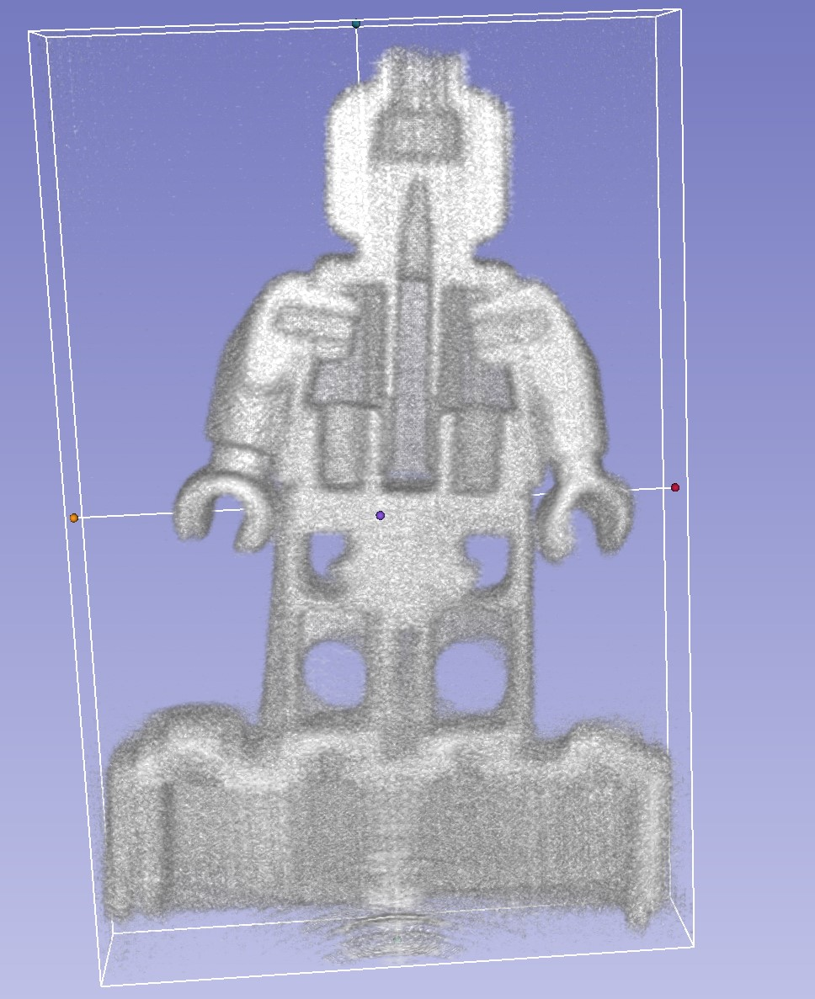
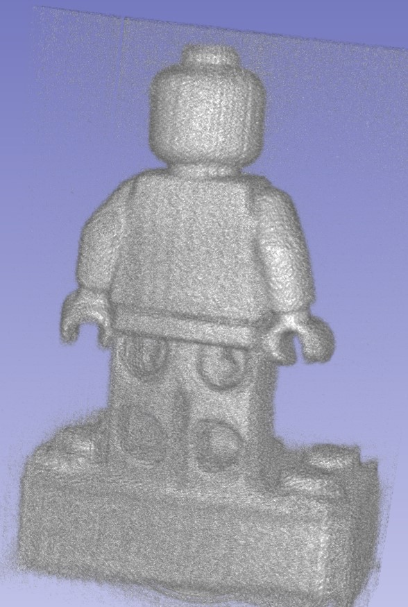
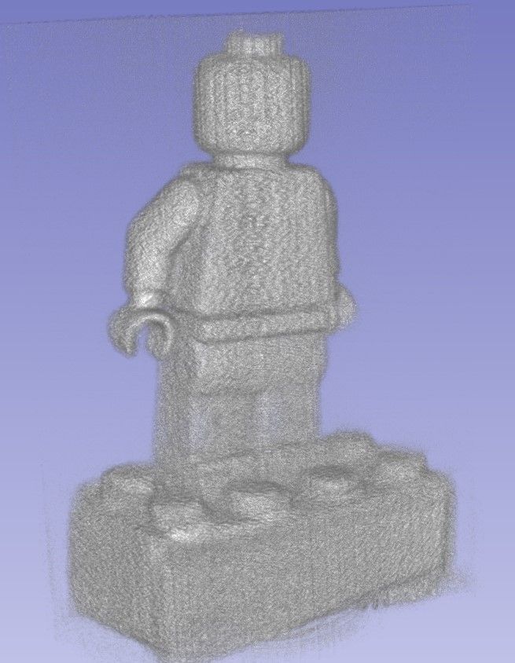

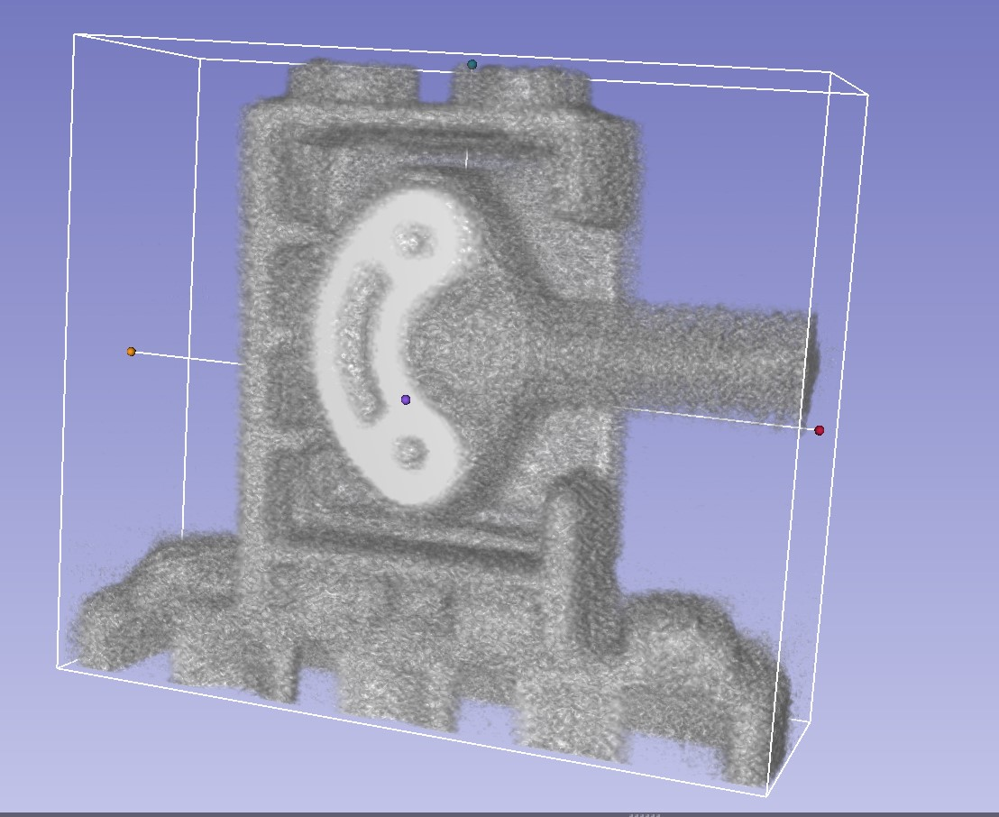
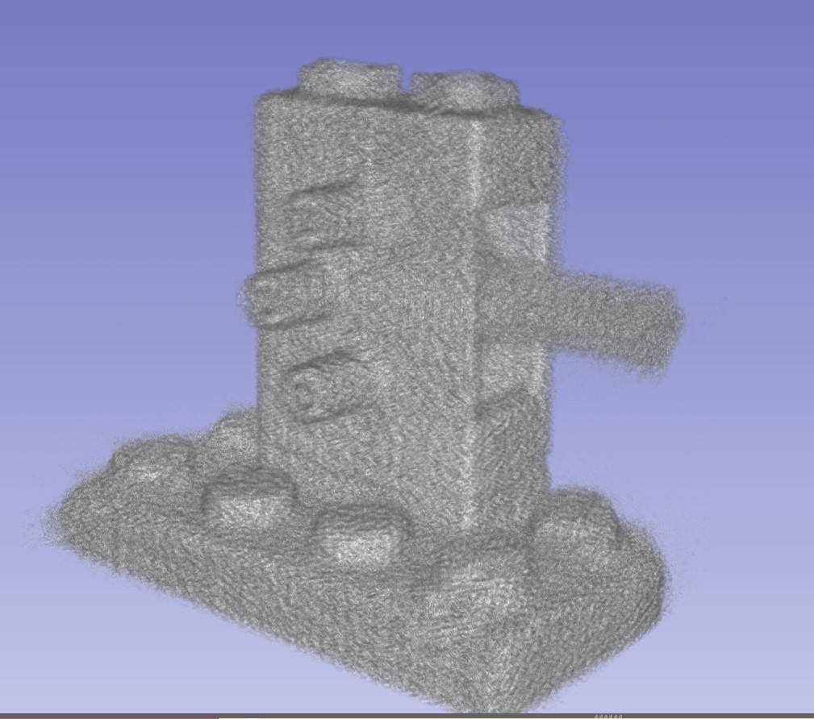
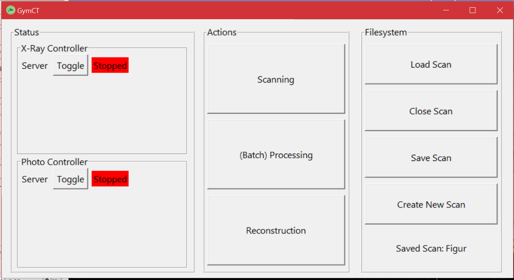

# GUI
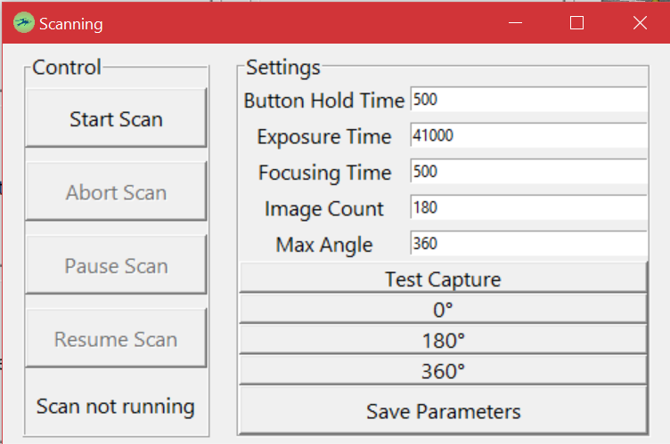
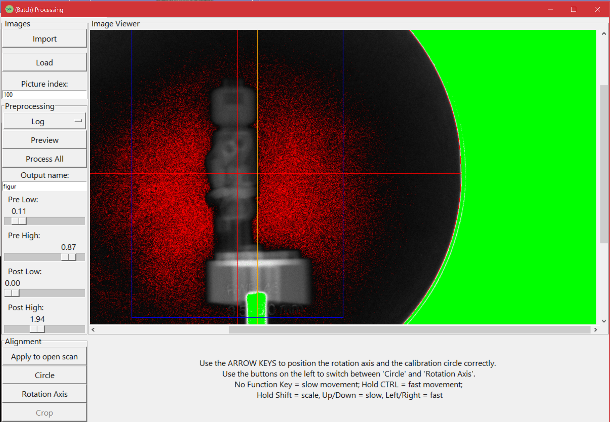
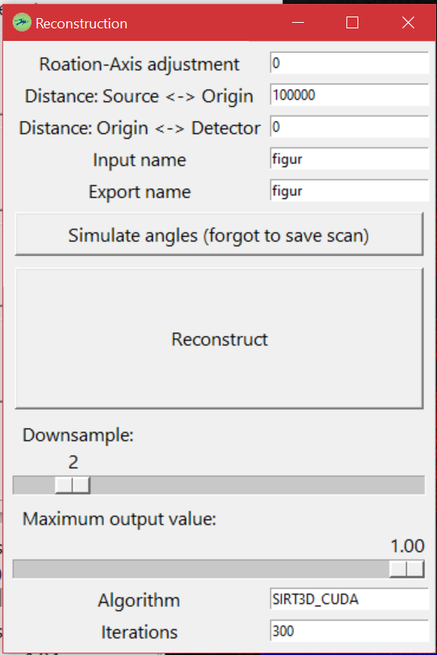

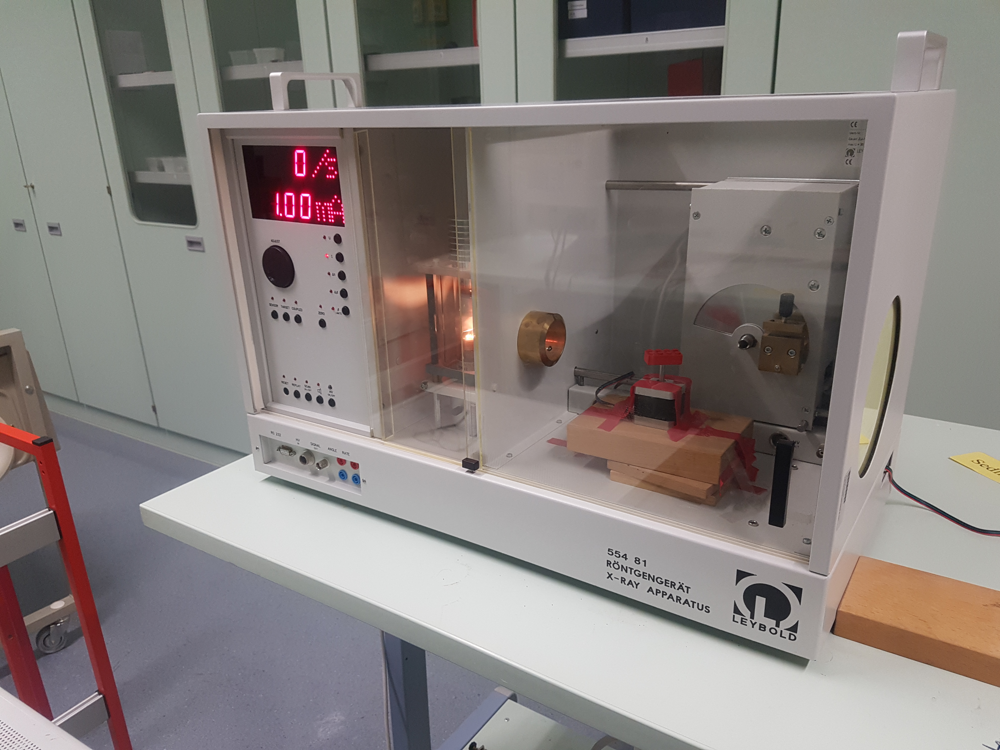

# Stepper controller schematic
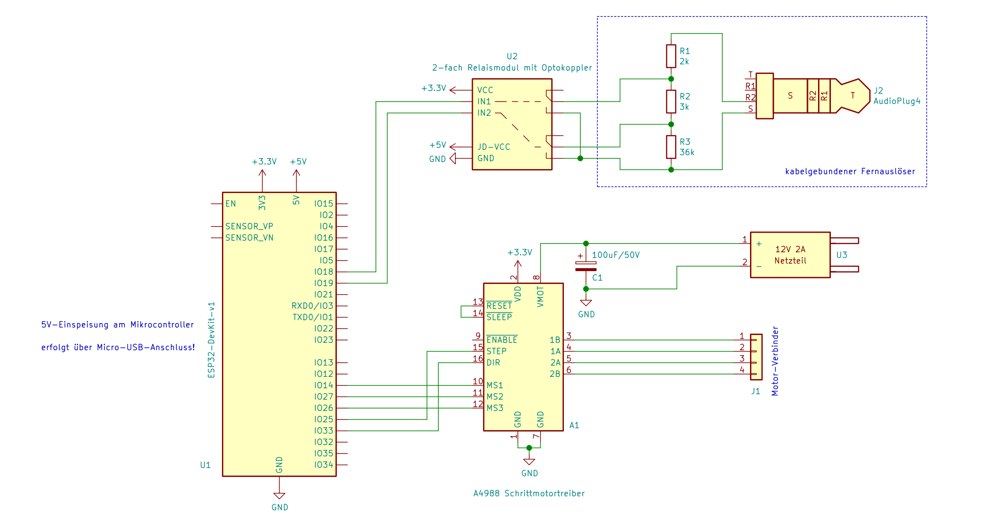

# Info
This was developed in 2020-2021 while I was in my final years of high school, where I had access to the pictured fully-shielded X-ray machine.
The X-ray images were recorded by taking photos of the (somewhat degraded and super dim) phosphorescent screen with a normal camera.
This required very long exposure times (~20s per image) at low sensitivity (ISO100) to achieve a somewhat acceptable noise floor.
